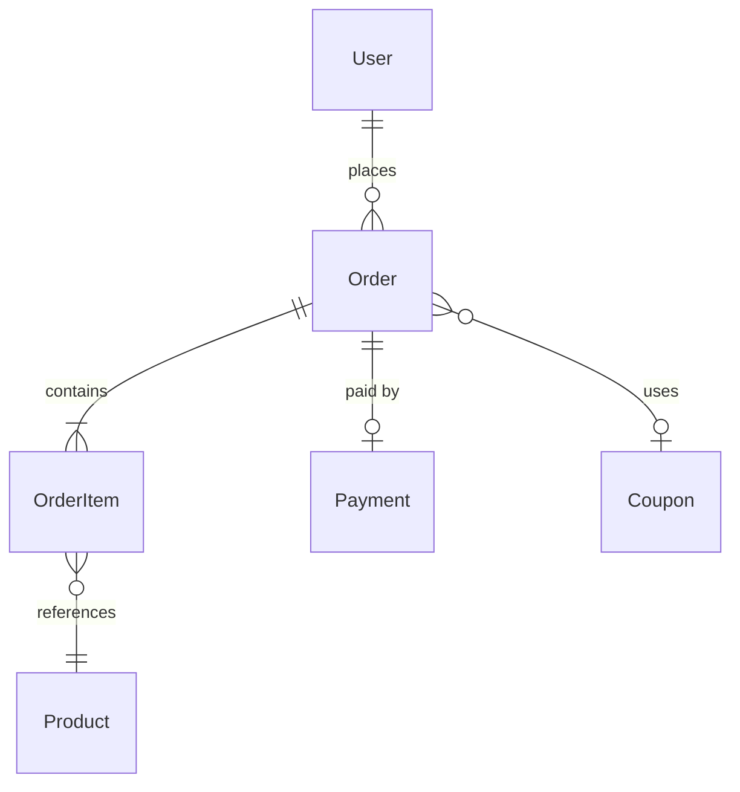

# 领域模型

> 本文件定义项目的核心领域模型，帮助 agent 理解业务实体关系，生成符合业务语义的代码。

## 限界上下文

<!-- Q: 你的项目包含哪些限界上下文（Bounded Context）？

示例：
| 上下文 | 职责 | 核心实体 |
|--------|------|---------|
| 交易上下文 | 下单、支付、退款 | Order, Payment, Refund |
| 商品上下文 | 商品管理、库存 | Product, SKU, Stock |
| 用户上下文 | 用户信息、地址 | User, Address |
| 营销上下文 | 优惠券、活动 | Coupon, Campaign |
-->

## 核心实体

<!-- Q: 列出每个实体的关键属性和业务规则。

示例：

### Order（订单）
- 聚合根
- 关键属性：orderId, userId, totalAmount, status, createdTime
- 状态流转：CREATED → PAID → SHIPPING → DELIVERED → COMPLETED / CANCELLED
- 业务规则：
  - 订单创建后 30 分钟未支付自动取消
  - 同一用户不能有超过 5 个未支付订单
  - 订单金额 = SUM(商品金额) - 优惠金额 + 运费
-->

## 实体关系

<!-- Q: 用 ER 图或文字描述实体间关系。

示例：

-->

## 领域事件

<!-- Q: 列出系统中的核心领域事件。

示例：
| 事件 | 触发条件 | 消费者 |
|------|---------|--------|
| OrderCreated | 订单创建成功 | 库存服务（扣减库存） |
| OrderPaid | 支付回调成功 | 履约服务（开始发货） |
| OrderCancelled | 订单取消 | 库存服务（释放库存）、支付服务（退款） |
-->
