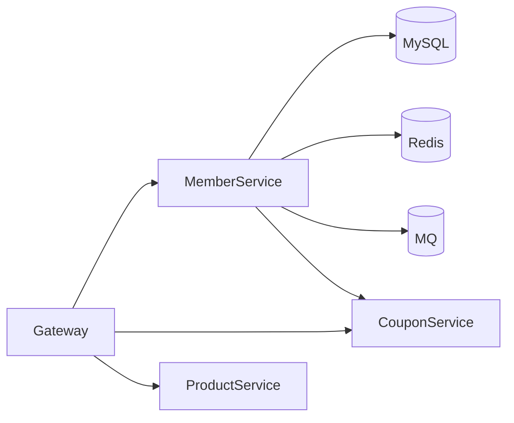

# 项目画像

> 本文件描述项目的技术栈、基础设施和服务拓扑。新项目引入本规范仓库后，复制此文件并根据实际情况调整。

## 基本信息

| 项目 | 内容 |
|------|------|
| 项目名称 | <!-- 填写你的项目名称，如：manager-member-premium --> |
| 项目描述 | <!-- 一句话描述，如：C端会员服务，负责会员管理、积分、权益 --> |
| 负责团队 | <!-- 填写团队名称 --> |
| 预期 QPS | <!-- 填写日常 QPS，如：2000+ --> |

## 技术栈（heytea 标准）

| 组件 | 选型 | 版本 |
|------|------|------|
| 编程语言 | Java | 1.8 |
| 应用框架 | Spring Boot | 2.3.1 |
| 构建工具 | Maven | - |
| ORM | MyBatis-Plus | 3.2 |
| 数据库 | MySQL | 8.0 / 5.7 |
| 分库分表 | ShardingSphere（按需） | - |
| 缓存 | Redis Cluster | 7.x |
| Redis 客户端 | Lettuce / Redisson | - |
| 消息队列 | RocketMQ / Kafka | 5.x / 3.x |
| RPC 框架 | OpenFeign + OkHttp | - |
| 熔断器 | Hystrix | - |
| 注册中心 | Nacos | 2.x |
| 配置中心 | Apollo / Nacos | - |
| 网关 | Spring Cloud Gateway / Kong | - |
| 搜索引擎 | Elasticsearch | 8.x |

## 基础设施（heytea 标准）

| 组件 | 选型 |
|------|------|
| 日志采集 | 腾讯云 CLS |
| 监控告警 | Prometheus + Grafana + AlertManager |
| 任务调度 | XXL-Job |
| 分布式 ID | Leaf / Snowflake（HeyteaUidGenerator） |
| 对象存储 | 阿里云 OSS |
| 短信/推送 | 自研网关 / 第三方 |
| 风控 | 自研规则引擎 |
| CI/CD | Jenkins |
| 容器化 | K8s + Docker |

## 核心依赖

| 组件名 | 用途 | Maven 坐标 |
|--------|------|-----------|
| heytea-spring-boot-core | 通用工具封装（Redis、OSS、统一响应体） | com.heytea:heytea-spring-boot-core |

## 服务拓扑

<!-- 按你的实际项目填写，以下为示例：

-->

## 现有公共组件

| 类名 | 用途 | 来源 |
|------|------|------|
| BaseResult&lt;T&gt; | 统一响应体 | heytea-spring-boot-core |
| BasePageForm | 分页请求基类 | heytea-spring-boot-core |
| BasePageVO&lt;T&gt; | 分页响应 | heytea-spring-boot-core |
| BizException | 业务异常 | heytea-spring-boot-core |
| SystemException | 系统异常 | heytea-spring-boot-core |
| HeyteaUidGenerator | 分布式 ID 生成 | heytea-spring-boot-core |
| HeyteaCache | Redis 缓存操作 | heytea-spring-boot-core |
