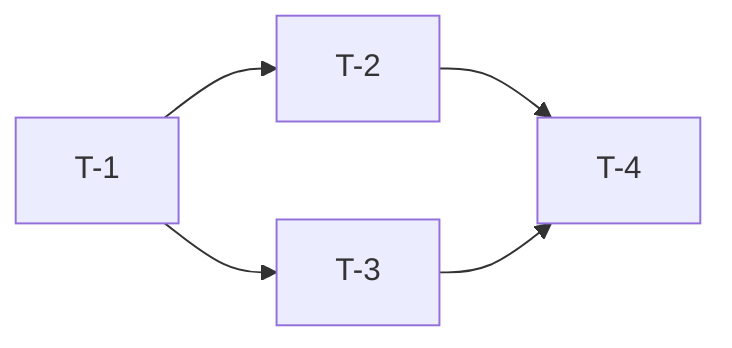

# 任务拆解

## 需求名称

<!-- 填写需求名称 -->

## 任务清单

| 编号 | 任务 | 类型 | 依赖 | 复杂度 | 状态 |
|------|------|------|------|--------|------|
| T-1 | | DDL/代码/配置/测试 | - | S/M/L | 待开始 |
| T-2 | | | T-1 | | 待开始 |
| T-3 | | | T-1 | | 待开始 |

## 任务详情

### T-1: 任务标题

| 项目 | 内容 |
|------|------|
| 描述 | |
| 改动范围 | <!-- 涉及哪些文件/模块 --> |
| 验收标准 | |
| 风险点 | |

### T-2: 任务标题

| 项目 | 内容 |
|------|------|
| 描述 | |
| 改动范围 | |
| 验收标准 | |
| 风险点 | |

## 依赖关系

## 总体预估

| 项目 | 内容 |
|------|------|
| 任务总数 | |
| 预计工时 | |
| 关键路径 | |
| 最大风险 | |
