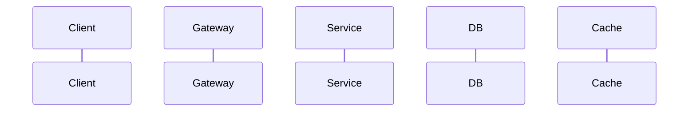

# 技术设计文档

## 修改历史

| 日期 | 修改人 | 修改内容 |
|------|--------|---------|
| YYYY-MM-DD | 姓名 | 初始版本 |

## 1. 需求概述

<!-- 简述需求背景和目标，附需求文档链接 -->

## 2. 整体方案

### 2.1 架构图

<!-- 使用 Mermaid 或图片描述整体架构 -->

### 2.2 核心流程

<!-- 使用时序图描述核心调用链路 -->

### 2.3 数据流

<!-- 描述数据从输入到持久化的完整路径 -->

## 3. 详细设计

### 3.1 接口设计

<!-- 列出新增/修改的接口，或引用 api-design-template -->

### 3.2 数据模型

<!-- 列出新增/修改的表结构，或引用 mysql-schema-template -->

### 3.3 缓存设计

<!-- 列出新增的缓存 key，或引用 redis-key-design-template -->

### 3.4 消息设计

<!-- 列出新增的消息主题，或引用 mq-topic-consumer-template -->

## 4. 异常处理

| 异常场景 | 检测方式 | 处理策略 | 影响范围 |
|---------|---------|---------|---------|
| | | | |

## 5. 降级方案

| 依赖 | 降级条件 | 降级行为 | 恢复方式 |
|------|---------|---------|---------|
| | | | |

## 6. 兼容性

<!-- 描述对现有系统的影响和兼容策略 -->

- 接口兼容性：
- 数据兼容性：
- 消息兼容性：

## 7. 性能评估

| 指标 | 预期值 | 依据 |
|------|--------|------|
| 预期 QPS | | |
| P99 延迟 | | |
| 数据库影响 | | |
| 缓存命中率 | | |

## 8. 上线方案

### 8.1 上线步骤

1. 
2. 
3. 

### 8.2 灰度策略

<!-- 描述灰度维度和放量节奏 -->

### 8.3 回滚方案

<!-- 描述回滚条件、回滚步骤 -->

### 8.4 观察指标

<!-- 上线后需要关注的监控指标 -->

## 9. 测试方案

<!-- 简述测试策略，详细内容引用 test-plan-template -->

## 10. 安全考量

<!-- 涉及的安全风险和应对措施 -->
